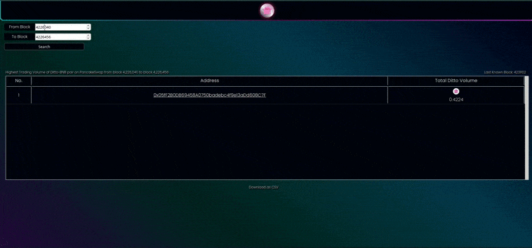

# Ditto Trading Volume Scan

This tool provides a list of addresses and corresponding amount of ditto traded within the specified start and end blocks. You can also export the data as a  csv file by clicking the `Download as csv` option.

In the project directory, you should run:

### `npm install` 

Installs all dependencies 

### `npm start`

Runs the app in the development mode.
Open [http://localhost:3000](http://localhost:3000) to view it in the browser.

The page will reload if you make edits.\
You will also see any lint errors in the console.

### `npm run build`

Builds the app for production to the `build` folder.\
It correctly bundles React in production mode and optimizes the build for the best performance.

You can also view the tool live here=> https://dittoscan.netlify.app/

